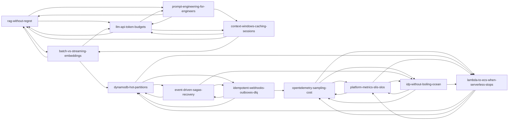

# Blog content plan — detailed review, validation, and rollout

This document is the **authoritative planning layer** for the twelve engineering posts that originated as title ideas (formerly `blogSuggestions.ts`). Canonical routes and long-form body live under **`data/blog/posts/{slug}.ts`** (aggregated via **`data/blog/registry.ts`** and re-exported from **`data/blogPosts.ts`** for imports). Each URL **`/blog/{slug}`** is expanded into a **long-form, humanised** article with **expected sections, figures, and citations** before we treat it as “done.”

**Career weapon (not “just a blog”):** every live post merges **`data/blog/narrative/{slug}.ts`** (war story, stance, numbers, read-next; barrel: `data/blog/narrative/index.ts`) and **`data/blog/career/{slug}.ts`** (diagram spec, CTO roadmap, interview scripts, references/links + hook + visual; barrel: `data/blog/career/index.ts`). The blog index is sorted by **`publishPriorityOrder`** in **`data/blog/publish-order.ts`** (re-exported from `data/blogCareerArtifacts.ts`). This stack is inbound + interview leverage—treat each URL as a **signal artifact factory**, not a diary.

---

## Career weapon playbook (signal → staff+ narrative)

### Step 1 — Each post produces signal artifacts

Ship three derivatives from every article (stored in code today; you copy-edit before posting):

| Artifact | Purpose |
|----------|---------|
| **Opinion hook** | One-line lead for LinkedIn / intro DMs—contrarian but defensible. |
| **One strong visual** | Single diagram or chart idea that survives a busy feed (spec text in `data/blog/career/{slug}.ts`). |
| **References & links** | Under “Signal pack” on the post page (`linkedInThread` in career data)—labeled hyperlinks + outline copy; not a literal LinkedIn embed. |

### Step 2 — CTO bait: “If I were building this from scratch”

Rendered at end of article: **Week 1**, **Month 1**, **Scale phase**. This answers “can you **lead** systems?” without claiming you invented gravity. Edit bullets to match what **you** would actually fund.

### Step 3 — Interview-ready summaries

Rendered block: **~30 sec** (recruiter/screening) and **~1 min** (CTO / hiring manager). Memorise these; they should track the same story as the war scenario and numbers.

### Step 4 — Architecture diagrams that feel real

The **diagram spec** list is not decoration: each line should become a sketch with **failure arrows**, **retry spirals**, and **bottlenecks** named. Generic three-box “frontend / backend / DB” is anti-signal.

### Step 5 — Publish order: **Power Trio** (weeks 1–3) + rest

Canonical order in **`publishPriorityOrder`** (`data/blog/publish-order.ts`) and on **`/blog`**:

| Week | Post | Why |
|------|------|-----|
| **1** | **RAG Without Regret** | High current market demand; shows taste on AI **systems** (retrieval, not model shopping). |
| **2** | **Lambda → ECS** | Principal-level **cost vs complexity** (tails, PC, NAT-shaped paths, observability tax). |
| **3** | **DynamoDB Hot Partitions** | **Scale architect** credentialing—skew, throttles, buffers, honest load tests. |
| **4** | **Idempotent Webhooks** | Opens the “tactical core” on money paths and at-least-once reality. |
| **5+** | LLM token budgets → sagas → OpenTelemetry → context → prompt → batch/streaming → SLIs/SLOs → IDP | Depth and breadth after the trio lands. |

Re-sequence only for a timed launch (talk, hiring sprint)—then update **`publishPriorityOrder`** and the note on `/blog` in one commit.

#### Tactical review — posts 1–3 (core depth)

**1. RAG Without Regret**

- **Hook idea:** Frustration when a “hallucination” was really a **PDF page break** splitting a critical **HTS** line across two chunks—half the digits never co-occurred in any retrieved window.  
- **Expert nuance:** **Contextual metadata / provenance**—do not store text alone; store doc id, page/byte span, chunker semver, content hash, ingest job id so audit and re-embed are joinable facts.  
- **Visual:** Small-to-big retrieval path + provenance strip + failure arrow when hydration is skipped.  
- **Validation:** Cover **small-to-big retrieval** (search small child chunks, feed **parent** context to the LLM); golden checks on **span**, not only doc id.

**2. Lambda → ECS**

- **Hook idea:** The **2:00 AM** page—provisioned concurrency could not scale fast enough for the spike; **p99** blew out; the line item looked like a **luxury car lease** while marketing still said “serverless.”  
- **Expert nuance:** **Observability tax**—on Lambda, extensions/sidecars still burn **billed** runtime; on ECS they typically **share the task envelope** (capacity planning differs; fewer per-invocation micro-surprises).  
- **Visual:** Strangler + dual histogram + observability tax strip.

**3. Idempotent Webhooks**

- **Hook idea:** Duplicate event at **~1k RPS** threatening to **double-book** inventory in an **electronics supply chain** path.  
- **Expert nuance:** **Deterministic ID generation** when upstream omits a key—canonical JSON, strip volatile fields, hash, **property tests** for collision vs stability.  
- **Visual:** Duplicate arrows, unique index + outbox transactional box, deterministic-id sub-flow.

#### Principal “humanisation” checklist (generic vs Mohit)

| Feature | Generic | Mohit-style |
|---------|---------|-------------|
| **Failures** | “RAG can be inaccurate.” | “We spent three days blaming temperature until someone opened the chunk viewer and saw half an HTS code in each chunk.” |
| **Costs** | “Cloud costs can be high.” | “PC + NAT-shaped paths made the Lambda line item look like a luxury car lease while p99 still missed SLO.” |
| **Trade-offs** | “Both have pros and cons.” | “I pick ECS when the team already ships Docker and tails drive the SLO—I would not learn Fargate and a new packaging model during the same quarter as a revenue launch.” |
| **Scale** | “Works at scale.” | “This pattern had to survive duplicate deliveries at ~1k RPS without double-booking ATP.” |

Apply this lens to every war story, `what_not`, and interview script before you ship.

---

## How to use this doc (refine → validate → ship)

1. **Pick a post** from the table below; read its “detailed review” and outline.
2. **Draft in your voice** (see [Voice and humanisation](#voice-and-humanisation)); replace composite blocks in `data/blog/narrative/{slug}.ts` with **your** war story, numbers, and “What I would NOT do” bullets when safe for employers/clients.
3. **Self-review** against the **validation checklist** for that post; tick items in a PR or private notes.
4. **Add assets**: place images under `public/blog/{slug}/` (or similar); reference them from the post body when we migrate from data-only sections to MDX/rich content.
5. **Technical accuracy pass**: run the **step validation** bullets (numbers, claims, links) with the **Sources** section open.
6. **Publish**: update `data/blog/posts/{slug}.ts` (or future MDX) + `readTime` + `publishedAt` when the long-form version ships.

---

## Route index (all twelve)

| # | Path | Slug |
|---|------|------|
| 1 | `/blog/rag-without-regret` | `rag-without-regret` |
| 2 | `/blog/lambda-to-ecs-when-serverless-stops` | `lambda-to-ecs-when-serverless-stops` |
| 3 | `/blog/idempotent-webhooks-outboxes-dlq` | `idempotent-webhooks-outboxes-dlq` |
| 4 | `/blog/opentelemetry-sampling-cost` | `opentelemetry-sampling-cost` |
| 5 | `/blog/prompt-engineering-for-engineers` | `prompt-engineering-for-engineers` |
| 6 | `/blog/llm-api-token-budgets` | `llm-api-token-budgets` |
| 7 | `/blog/context-windows-caching-sessions` | `context-windows-caching-sessions` |
| 8 | `/blog/batch-vs-streaming-embeddings` | `batch-vs-streaming-embeddings` |
| 9 | `/blog/dynamodb-hot-partitions` | `dynamodb-hot-partitions` |
| 10 | `/blog/event-driven-sagas-recovery` | `event-driven-sagas-recovery` |
| 11 | `/blog/platform-metrics-slis-slos` | `platform-metrics-slis-slos` |
| 12 | `/blog/idp-without-boiling-ocean` | `idp-without-boiling-ocean` |

The **#** column is file/slug convenience only; **publish order** follows the **Power Trio** in Step 5 below (`publishPriorityOrder` in `data/blog/publish-order.ts`).

**Expected end state:** each path renders a **2.5k–5k word** (or equivalent depth) article, **5–12 figures** where outlined, **first-person or “we”** engineering voice, and **sources** echoed or linked in a “Further reading” block at the bottom of each post (not only in this plan).

---

## Voice and humanisation (applies to every post)

Write as **you**: Mohit Tambi — principal/staff-level engineer, not a generic AI blog.

- **Openings**: one concrete scene (on-call, migration week, review comment) before the thesis.
- **Opinions**: name trade-offs you have actually lived with (“we chose X because…”).
- **Humility**: where guidance is generic, say so; where it is battle-tested, cite the context (size, stack, year).
- **Rhythm**: vary sentence length; use short paragraphs; avoid stacked buzzword triads.
- **Jargon**: define acronyms once; assume a strong senior IC reader.
- **Avoid**: content-farm patterns (“In today’s fast-paced world”), fake quotes, fabricated metrics. Use **ranges** or **qualitative** outcomes if you cannot publish numbers.

---

## Editorial standards (four gaps — required for every shipped post)

### Gap 1 — Opinion positioning (take a stance)

Top engineering writing is not neutral Wikipedia. Readers follow authors who **say what they would not do** and name the trade-off.

| Weak (hedged) | Strong (positioned) |
|----------------|---------------------|
| “Hybrid search helps in some cases.” | “Hybrid search is overrated unless your corpus has high lexical variance (legal, SKU-heavy, mixed-language). In most SaaS runbooks/docs setups, BM25+vector added complexity without a measurable lift on our frozen production query set.” |
| “Consider tail sampling.” | “I would not run 100% trace capture on services with fan-out above ~40 child spans unless someone is explicitly funding storage and query SRE time.” |

**Required section in every post:** **“What I would NOT do”** (3–5 bullets). No hedging weasel words (“might”, “could potentially”) unless you immediately explain the condition under which you would do the thing.

**Live implementation:** narrative blocks merged in `getBlogPostBySlug()` from `data/blog/narrative/` (red callout on the post page).

### Gap 2 — Real system narrative (structured war story)

“Add an anecdote” is not enough. Every post needs a **scar with receipts**—even if anonymised as a **composite** until you can publish real details.

**Required block (fixed headings):**

| Field | Content |
|--------|---------|
| **Context** | Scale, system shape, constraint (RPS, tenants, stack). |
| **What broke** | Observable failure; user or business impact. |
| **What we tried first (wrong)** | The tempting fix that failed. |
| **Final solution** | What actually worked. |
| **Trade-off we accepted** | What got worse or more expensive on purpose. |

**Live implementation:** “Real scenario” aside on each post page; source strings in `data/blog/narrative/{slug}.ts` (replace composites with your own war stories when safe).

### Gap 3 — Numbers thinking (orders of magnitude)

Senior readers trust **ranges**, **before/after**, and **ratios**—not fake precision. Approximate and composite numbers are fine if labelled (the UI note under “Orders of magnitude” does this).

Examples of the upgrade:

| Weak | Strong |
|------|--------|
| “Tail latency increased.” | “P99 moved from ~120ms to ~650–900ms during cold-start bursts under ~1.8k RPS.” |
| “Eval felt small.” | “Below ~300 diverse cases we were measuring noise; past ~2k we started catching slow regressions.” |

**Required block:** **“Orders of magnitude”** with 2–4 bullets mixing **~**, **×**, **%**, durations, or cost **bands**. Replace with measured values when you publish under your own name.

**Live implementation:** `numbers_note` blocks from `data/blog/narrative/{slug}.ts`.

### Gap 4 — Cross-post narrative (knowledge graph)

Isolated posts do not compound authority. At the end of each article, **explicitly point readers** to the next posts that share failure modes or tooling—same pattern as the [AWS Builders Library](https://aws.amazon.com/builders-library/) (curated trails, not a flat pile of PDFs).

**Required block:** “If this problem shows up, read next:” with **2–3 internal links** and one line each on **why** that post is the logical follow-up.

**Live implementation:** `read_next` nav on each post; edges defined per slug in `data/blog/narrative/{slug}.ts`.

#### Cross-link graph (edit here when you add posts)

When you refine an edge, update **both** the diagram and `readNextItems` for that slug so the site and doc stay aligned.

---

## 1. RAG Without Regret: Chunking, Embeddings, and Evaluating Retrieval Quality

**Path:** `/blog/rag-without-regret`

### Detailed review

RAG fails more often at the **retrieval and chunking** layer than at the LLM. Readers need a **decision framework**: when fixed windows are acceptable, when structure-aware chunking wins, how **embedding + lexical** hybrid behaves under domain jargon, and how to **eval** retrieval with golden sets that resemble production—not toy QA. The post should connect ingestion versioning to safe re-embeds and rollback.

### Proposed outline (long-form target)

1. Hook: a wrong-chunk or wrong-retrieval war story (anonymised).
2. Problem framing: model vs retrieval attribution (how to tell which failed).
3. Chunking strategies: fixed vs semantic vs document-structure; tables and logs.
4. Embeddings: model choice, dimensionality, multilingual; hybrid and rerankers.
5. Index lifecycle: versioning chunkers, idempotent ingestion, backfill strategy.
6. Evaluation: golden queries, adversarial sets, precision@k, abstention/calibration.
7. Ops: dashboards, alerting on retrieval quality drift, cost of re-embedding.
8. Closing: checklist table + “what I would do on week one.”

### Expected images / diagrams

- **Figure A**: Chunking strategies side-by-side on a sample doc (PDF vs Markdown).
- **Figure B**: Retrieval pipeline (ingest → embed → index → query → rerank → LLM).
- **Figure C**: Sample eval dashboard sketch (metrics you would actually watch).
- **Figure D**: “Bad chunk” vs “good chunk” callout boxes.

### Validation checklist (each step must be defensible)

- [ ] Every chunking recommendation ties to a **failure mode**, not preference.
- [ ] Eval section names **concrete metrics** (e.g. nDCG, MRR, P@k) and when each matters.
- [ ] Hybrid search claim is qualified (when BM25 helps vs hurts).
- [ ] Re-embed / rollback story includes **versioned** chunk rules or index alias.
- [ ] No vendor-lock-in prose unless you name what **you** used.

---

## 2. From Lambda to ECS: When Serverless Stops Being the Right Default

**Path:** `/blog/lambda-to-ecs-when-serverless-stops`

### Detailed review

This is a **decision and migration** piece, not anti-Lambda. Readers want **signals** (cold start, concurrency, VPC, package size, observability sidecars), a **cost framing** that includes ops burden, and a **migration** pattern (strangler, feature flags, rollback). Avoid treating ECS as “always better”; emphasise **blast radius** and **team skill** parity.

### Proposed outline

1. Hook: latency SLO miss or reserved concurrency contention.
2. When Lambda is still the right default (honest list).
3. When ECS/Fargate (or similar) reduces tail risk or complexity.
4. VPC, connections, and long-lived work: the boring details.
5. Sizing tasks from measured CPU/memory; autoscaling semantics.
6. Migration: API façade, traffic shift, dual-run, rollback.
7. FinOps: comparing invocation billing vs task-hour + data transfer.
8. Closing: decision matrix (not a flowchart meme—a real table).

### Expected images

- **Figure A**: Lambda vs container responsibility split (what moves where).
- **Figure B**: Migration phases timeline (0–100% traffic).
- **Figure C**: Example autoscaling graph annotation (what “good” looks like).

### Validation checklist

- [ ] Cold start discussion distinguishes **init** vs **provisioned** vs **architecture**.
- [ ] Concurrency limits tied to **real AWS behaviour** (document links in post).
- [ ] Migration path includes **rollback** in one step or less.
- [ ] Cost section states **assumptions** (region, traffic shape, ARM vs x86).

---

## 3. Designing Idempotent Webhooks at Scale: Outboxes, Dedupe Keys, and DLQs

**Path:** `/blog/idempotent-webhooks-outboxes-dlq`

### Detailed review

Webhooks are **at-least-once**. The post must make **idempotency keys**, **storage constraints**, and **outbox** transactional boundaries crisp. DLQs need **operational maturity**: replay tooling, poison message policy, ordering when it matters. Stripe-style thinking is a good mental model; ground in **your** stack (e.g. Postgres unique index + outbox table).

### Proposed outline

1. Hook: duplicate charge or duplicate provisioning (generic example).
2. Delivery semantics: retries, backoff, clock skew.
3. Dedupe: provider id vs content hash; unique indexes; response replay.
4. Outbox pattern: same transaction as business write; dispatcher.
5. Ordering: partitions, keys, when strict order is required.
6. DLQ: alert thresholds, sampling, human replay runbook.
7. Security: signature verification, replay attacks, id rotation.
8. Closing: minimal schema sketch (text or diagram).

### Expected images

- **Figure A**: Sequence diagram: webhook → dedupe → outbox → worker.
- **Figure B**: State machine for retry vs DLQ.
- **Figure C**: Example table columns for idempotency store.

### Validation checklist

- [ ] States **at-least-once** explicitly; no accidental “exactly once” claim without caveats.
- [ ] Outbox + business write **same transaction** or explains alternative.
- [ ] DLQ section includes **replay safety** (idempotent consumers).
- [ ] Signature verification mentioned with **timestamp tolerance**.

---

## 4. OpenTelemetry in Production: Sampling Strategies That Do Not Drown You in Cost

**Path:** `/blog/opentelemetry-sampling-cost`

### Detailed review

Readers need **head vs tail** sampling, **collector** role, cardinality discipline, and **retention tiers**. Tie cost to **cardinality and span volume**, not moralising. Include failure modes: tail sampling memory pressure, inconsistent parent-based decisions if misconfigured.

### Proposed outline

1. Hook: trace backend bill or slow queries on trace ID.
2. Goals: coverage vs cardinality vs latency overhead.
3. Head sampling: consistent probability; what breaks if inconsistent.
4. Tail sampling: error/latency rules; collector deployment notes.
5. Filtering: health checks, synthetics, high-volume low-value routes.
6. Cardinality: attribute budgets; high-cardinality anti-patterns.
7. Retention and tiering; links to vendor-agnostic concepts.
8. Closing: starter policy for a new service vs mature platform.

### Expected images

- **Figure A**: Trace path from SDK → agent → collector → backend.
- **Figure B**: Decision tree: when to add tail sampling.
- **Figure C**: Example sampling config (redacted YAML).

### Validation checklist

- [ ] Parent-based sampling coherence explained (or linked).
- [ ] Tail sampling warns about **memory** / delayed export trade-offs.
- [ ] “Drop health checks” is justified with **how** to implement safely.
- [ ] Vendor mentions are optional; concepts stay **portable**.
- [ ] **Collector vs SDK** stance documented: collector-first for **cost/cardinality** (gateway drops before paid backends); SDK head sampling when **app CPU/egress** dominates; tail sampling at collector for whole-trace view.

### Editorial validation (Post 4)

**Question:** Focus on collector-side processing (drop spans at the gateway) or SDK-side (sample before export)? **Answer in copy:** both—**primary economic lever at the collector** (trim noise, cap attributes, tail policy before storage); **SDK sampling** when hot paths cannot afford serialising/exporting spans that will be discarded anyway. Avoid “SDK-only” as the sole cost strategy.

---

## 5. Prompt Engineering for Engineers: Schemas, Few-Shot Layouts, and Regression Tests

**Path:** `/blog/prompt-engineering-for-engineers`

### Detailed review

Position prompts as **interfaces**: schemas (JSON, tools), validators, **few-shot** ordering, and **eval harnesses** in CI. Cover model upgrades: pin vs float, regression drift, temperature choices per task class. Humanisation: “what broke when we upgraded the model.” With **AWS Bedrock**, call out **model-agnostic** task specs vs **model-specific** adapters (e.g. Claude-friendly sectioning / XML-style delimiters vs Llama-style instruction headers and stop behaviour).

### Proposed outline

1. Hook: silent JSON parse failures after a model change.
2. Contracts: system vs developer vs user messages (if applicable).
3. Structured outputs and server-side validation.
4. Few-shot design: diversity, ordering, anti-pattern examples.
5. Testing: golden outputs, rubrics, semantic similarity where needed.
6. Release process: model pins, canaries, rollback.
7. Closing: minimal template repo structure (bullet list).

### Expected images

- **Figure A**: Before/after prompt layout (wireframe).
- **Figure B**: CI pipeline stage “prompt eval.”
- **Figure C**: Example rubric table.

### Validation checklist

- [ ] Distinguishes **extraction** vs **generation** quality strategies.
- [ ] Does not promise “no hallucinations”; describes **mitigation**.
- [ ] Few-shot section warns against **leaking PII** from examples.
- [ ] Testing section names **at least two** measurable signals.
- [ ] **AWS Bedrock**: **model-agnostic** contracts vs **model-specific** prompt encoding (Claude vs Llama families) called out.

---

## 6. LLM API Usage: Token Budgets, Model Routing, and Per-Feature Cost Attribution

**Path:** `/blog/llm-api-token-budgets`

### Detailed review

This is **FinOps + product** for LLMs: tagging (`feature`, `tenant`, `workflow_id`), soft/hard caps, routing tables, caching strategy, and dashboards leadership trusts. Include ethical note: do not hide degradation from users without UX copy.

### Proposed outline

1. Hook: invoice spike nobody could attribute.
2. Instrumentation: what to log per call (tokens, model, outcome).
3. Budgets: soft vs hard; degradation UX patterns.
4. Routing: task taxonomy → model map; when to revisit.
5. Caching and memoisation: what is safe to cache.
6. Dashboards: dimensions finance and engineering agree on.
7. Closing: example weekly review ritual.

### Expected images

- **Figure A**: Cost attribution tree (product → feature → call type).
- **Figure B**: Example budget policy table.
- **Figure C**: Routing flowchart.

### Validation checklist

- [ ] Attribution dimensions are **implementable** in middleware.
- [ ] Caching section names **invalidation** when user state changes.
- [ ] Routing avoids “always biggest model” default without justification.
- [ ] Privacy: what **not** to log (payloads, PII).

---

## 7. Context Windows Are Not a Database: Caching, Summarisation, and Long-Session Retention

**Path:** `/blog/context-windows-caching-sessions`

### Detailed review

Attack the anti-pattern: **megabyte transcripts** as source of truth. Promote external state, summarisation with validation, TTLs, and invalidation on factual updates. Bridge to **UX**: multi-device, audit, compliance.

### Proposed outline

1. Hook: “the model forgot” vs “we never stored it.”
2. What belongs in prompt vs durable store.
3. Summarisation strategies; verification pass.
4. Cache layers: retrieval cache vs session cache.
5. Invalidation on fact change; conflict resolution.
6. Multi-tab and multi-device consistency (high level).
7. Closing: reference architecture diagram narrative.

### Expected images

- **Figure A**: Context vs durable store diagram.
- **Figure B**: Session lifecycle timeline with TTLs.
- **Figure C**: Summarisation + validator loop.

### Validation checklist

- [ ] Never implies the context window is **durable storage**.
- [ ] Summarisation includes **failure** case (summary wrong).
- [ ] Invalidation is tied to a **concrete trigger** (event, version, TTL).
- [ ] Compliance mentioned only if you keep claims **general** or anonymised.

---

## 8. Batch vs Streaming for Embeddings and Eval Harnesses

**Path:** `/blog/batch-vs-streaming-embeddings`

### Detailed review

Contrast **throughput backfills** vs **near-real-time** ingestion; idempotency; checkpointing; eval harness as a scheduled job with **pinned** datasets and models. Connect to cost and staleness SLOs.

### Proposed outline

1. Hook: double-indexed vectors after a retry storm.
2. Batch: partitioning, checkpoints, idempotent writes.
3. Streaming: debouncing, micro-batches, latency budget.
4. Mixed systems: how to avoid torn reads during query.
5. Eval harness: snapshots, regression gates, SLA for eval runtime.
6. Closing: when to start with batch even if you want streaming later.

### Expected images

- **Figure A**: Batch pipeline diagram with checkpoints.
- **Figure B**: Streaming micro-batch windows.
- **Figure C**: Eval job output diff (conceptual).

### Validation checklist

- [ ] Idempotency keys or natural keys for **vector writes** addressed.
- [ ] Eval harness pins **data + model**; explains why.
- [ ] Streaming section states **latency vs cost** trade-off explicitly.

---

## 9. DynamoDB Hot Partitions: Patterns That Actually Work Under Write Spikes

**Path:** `/blog/dynamodb-hot-partitions`

### Detailed review

Explain partition limits **conceptually** (without claiming numbers that change—point to AWS docs for current throttles). Patterns: write sharding, composite keys, GSIs, streams, buffering with SQS/Kinesis, adaptive capacity nuance at high level. For **multi-tenant** products (e.g. Senseahead-style telemetry), tie data-plane key design to **ABAC** (IAM principal/session attributes + resource tags, DynamoDB fine-grained access) so isolation is not only “correct PK prefix in app code.”

### Proposed outline

1. Hook: throttle storm on a “global counter” or viral key.
2. How partition heat shows up in metrics and errors.
3. Write sharding patterns; read path cost.
4. Streams and async aggregation.
5. Counters: DynamoDB vs dedicated services; trade-offs.
6. Testing: load test methodology that does not lie.
7. Closing: anti-pattern gallery (short bullets).

### Expected images

- **Figure A**: Hot key vs sharded key diagram.
- **Figure B**: Write path with queue buffer.
- **Figure C**: Metrics panel callouts (what to watch).

### Validation checklist

- [ ] Numeric limits **referenced** to official AWS documentation, not hard-coded forever in prose.
- [ ] Read amplification of sharding is **acknowledged**.
- [ ] Includes **test** plan, not only design patterns.
- [ ] **ABAC** mentioned for tenant isolation story (attributes on principals/resources; avoid policy/tag sprawl).

---

## 10. Event-Driven Sagas: Compensations, Timeouts, and Human-in-the-Loop Recovery

**Path:** `/blog/event-driven-sagas-recovery`

### Detailed review

Cover **choreography vs orchestration**, saga state persistence, **compensating transactions**, timeouts as state transitions, and **human** intervention for irreversible steps. Use a tangible example (order → payment → inventory) without claiming a specific employer’s system.

### Proposed outline

1. Hook: stuck saga in “unknown” state after partial failure.
2. Saga basics and partial failure reality.
3. Choreography: pros/cons; debugging story.
4. Orchestration: pros/cons; single point of truth.
5. Compensation ordering; idempotent compensators.
6. Timeouts, deadlines, escalation paths.
7. Human-in-the-loop: audit, permissions, replay.
8. Closing: minimal state model (enum + rules).

### Expected images

- **Figure A**: Saga timeline with success and compensation paths.
- **Figure B**: State machine diagram.
- **Figure C**: Human escalation swimlane.

### Validation checklist

- [ ] Compensation **idempotency** explicit.
- [ ] Distinguishes **technical** retry from **business** reversal.
- [ ] Human steps include **audit** and authorisation, not “email Bob.”
- [ ] No “distributed transactions are easy” vibes.

---

## 11. Platform Metrics That Leadership Actually Trust: SLIs, SLOs, and Error Budgets

**Path:** `/blog/platform-metrics-slis-slos`

### Detailed review

Bridge **user-perceived** reliability to **SLIs**, then **SLOs** and **error budgets** as negotiation tools. Address cynicism: vanity metrics, excluding bad traffic dishonestly, multi-window burn rates at a high level. Tie to engineering decisions: freeze features, invest in toil reduction.

### Proposed outline

1. Hook: “99.9%” that leadership does not believe.
2. SLI types: availability, latency, freshness, correctness (careful).
3. Choosing SLO targets with error budget policy.
4. Multi-window burn alerts (conceptual; link for math).
5. Error budget policy examples (freeze vs pay down debt).
6. Review cadence: quarterly SLO review agenda.
7. Closing: one-page SLO template.

### Expected images

- **Figure A**: User journey annotated with SLI measurement points.
- **Figure B**: Error budget burn chart sketch.
- **Figure C**: Example SLO document outline.

### Validation checklist

- [ ] SLIs are **measurable** from defined boundaries.
- [ ] Honest discussion of **exclusion** policies and abuse.
- [ ] Error budget ties to **actions**, not vanity dashboards.
- [ ] Burn rates: either **explain simply** or link out—no wrong formulas.

---

## 12. Building an Internal Developer Platform Without Boiling the Ocean

**Path:** `/blog/idp-without-boiling-ocean`

### Detailed review

IDP adoption is **cultural and sequencing**. Golden paths, paved roads, self-service with guardrails, policy-as-code, showback/chargeback, and **staffing** (engineers who have shipped recently). Avoid catalogue sprawl as success metric. Frame the IDP as **DevEx and retention**: reduce YAML/ticket toil so strong ICs do not route around the org or burn out on undifferentiated glue.

### Proposed outline

1. Hook: mandated platform nobody used.
2. Golden path definition and first workflow to pave.
3. Metrics: time-to-first-deploy, MTTR, developer NPS (carefully).
4. Guardrails vs gates; exceptions process.
5. Org design: platform team composition and rotation.
6. Showback and accountability for platform cost/complexity.
7. Closing: 90-day plan sketch.

### Expected images

- **Figure A**: Golden path vs long tail diagram.
- **Figure B**: Before/after developer journey map.
- **Figure C**: Platform roadmap horizon (Q1/Q2) example.

### Validation checklist

- [ ] Success metrics are **outcome**-based, not feature-count.
- [ ] **DevEx** angle explicit (TTFD, MTTR, toil)—not “we shipped a portal.”
- [ ] Exceptions path exists—**no** “one size fits all” fantasy.
- [ ] Includes **cost** and **cognitive load** of the platform itself.
- [ ] Honest about **Kubernetes** optionalism (do not assume K8s everywhere).

---

## Cross-post refinement workflow (validate each step)

| Step | Action | Done when |
|------|--------|-----------|
| 1 | Outline peer review (you or trusted IC) | Outline approved; scope frozen |
| 2 | First draft in voice | Opening hook + three “meat” sections drafted |
| 3 | Technical review | Every claim has source, metric, or clear opinion label |
| 4 | Figure pass | Each planned image has caption + alt text |
| 5 | Legal/safety pass | No confidential employer data; trademarks used nominatively |
| 6 | Copy edit | Tighten; remove AI cadence; read aloud |
| 7 | Ship to `data/blog/posts/{slug}.ts` / MDX | `readTime` and `publishedAt` updated; links live |
| 8 | Post-publish | Sitemap ok; OG preview ok on one messenger + one crawler tool |

---

## Sources (shared across posts; cite selectively in each article)

Official and high-signal references—**pick what you actually used** per post; do not carpet-bomb links.

### AWS and cloud

- AWS Lambda — Developer Guide: [https://docs.aws.amazon.com/lambda/latest/dg/welcome.html](https://docs.aws.amazon.com/lambda/latest/dg/welcome.html)  
- AWS Lambda — Best practices: [https://docs.aws.amazon.com/lambda/latest/dg/best-practices.html](https://docs.aws.amazon.com/lambda/latest/dg/best-practices.html)  
- Amazon ECS — Developer Guide: [https://docs.aws.amazon.com/AmazonECS/latest/developerguide/Welcome.html](https://docs.aws.amazon.com/AmazonECS/latest/developerguide/Welcome.html)  
- Amazon DynamoDB — Developer Guide: [https://docs.aws.amazon.com/amazondynamodb/latest/developerguide/Welcome.html](https://docs.aws.amazon.com/amazondynamodb/latest/developerguide/Welcome.html)  
- DynamoDB — Best practices: [https://docs.aws.amazon.com/amazondynamodb/latest/developerguide/best-practices.html](https://docs.aws.amazon.com/amazondynamodb/latest/developerguide/best-practices.html)  

### Reliability, SRE, metrics

- Google, *Site Reliability Engineering* (free book): [https://sre.google/sre-book/table-of-contents/](https://sre.google/sre-book/table-of-contents/)  
- Google, *The Site Reliability Workbook*: [https://sre.google/workbook/table-of-contents/](https://sre.google/workbook/table-of-contents/)  
- Google, *Monitoring distributed systems* (chapter): [https://sre.google/sre-book/monitoring-distributed-systems/](https://sre.google/sre-book/monitoring-distributed-systems/)  

### Observability and OpenTelemetry

- OpenTelemetry — Documentation: [https://opentelemetry.io/docs/](https://opentelemetry.io/docs/)  
- OpenTelemetry — Sampling: [https://opentelemetry.io/docs/concepts/signals/traces/#sampling](https://opentelemetry.io/docs/concepts/signals/traces/#sampling)  

### Integration, events, sagas

- Hohpe & Woolf, *Enterprise Integration Patterns* (catalogue and messaging patterns): [https://www.enterpriseintegrationpatterns.com/](https://www.enterpriseintegrationpatterns.com/)  
- AWS — Event-driven architecture: [https://aws.amazon.com/event-driven-architecture/](https://aws.amazon.com/event-driven-architecture/)  

### Webhooks and HTTP APIs (industry practice)

- Stripe — Webhooks guide (signatures, best practices): [https://stripe.com/docs/webhooks](https://stripe.com/docs/webhooks)  

### RAG, retrieval, and LLM product engineering

- Lewis et al., *Retrieval-Augmented Generation for Knowledge-Intensive NLP Tasks* (NeurIPS 2020): [https://arxiv.org/abs/2005.11401](https://arxiv.org/abs/2005.11401)  
- Anthropic — Prompt engineering overview (vendor-specific but clear): [https://docs.anthropic.com/en/docs/build-with-claude/prompt-engineering/overview](https://docs.anthropic.com/en/docs/build-with-claude/prompt-engineering/overview)  
- OpenAI — Prompt engineering guide: [https://platform.openai.com/docs/guides/prompt-engineering](https://platform.openai.com/docs/guides/prompt-engineering)  

### Platform engineering (culture and practice)

- Team Topologies (product site — platform teams model): [https://teamtopologies.com/](https://teamtopologies.com/)  
- CNCF TAG App Delivery — Platforms white paper (PDF linked from their site): [https://tag-app-delivery.cncf.io/](https://tag-app-delivery.cncf.io/)  

### Optional deep cuts (use when relevant)

- Dean & Barroso, *The Tail at Scale* (tail latency): [https://research.google/pubs/pub40801/](https://research.google/pubs/pub40801/)  
- Amazon Builder’s Library (high-quality AWS articles): [https://aws.amazon.com/builders-library/](https://aws.amazon.com/builders-library/)  

---

## Note on `blogSuggestions.ts`

The file **`data/blogSuggestions.ts` was removed** when posts were promoted to **`data/blog/posts/`** (barrel + `data/blogPosts.ts` re-exports). This plan doc **supersedes** the old title-only list: it preserves the twelve titles as **fully specified editorial briefs** aligned to **`/blog/{slug}`**.

When each long-form post is finished, replace the corresponding sections in **`data/blog/posts/{slug}.ts`** (or migrate to MDX) so the live site matches the depth promised here.

---

*Last updated: aligned with repository routes under `data/blog/`.*
